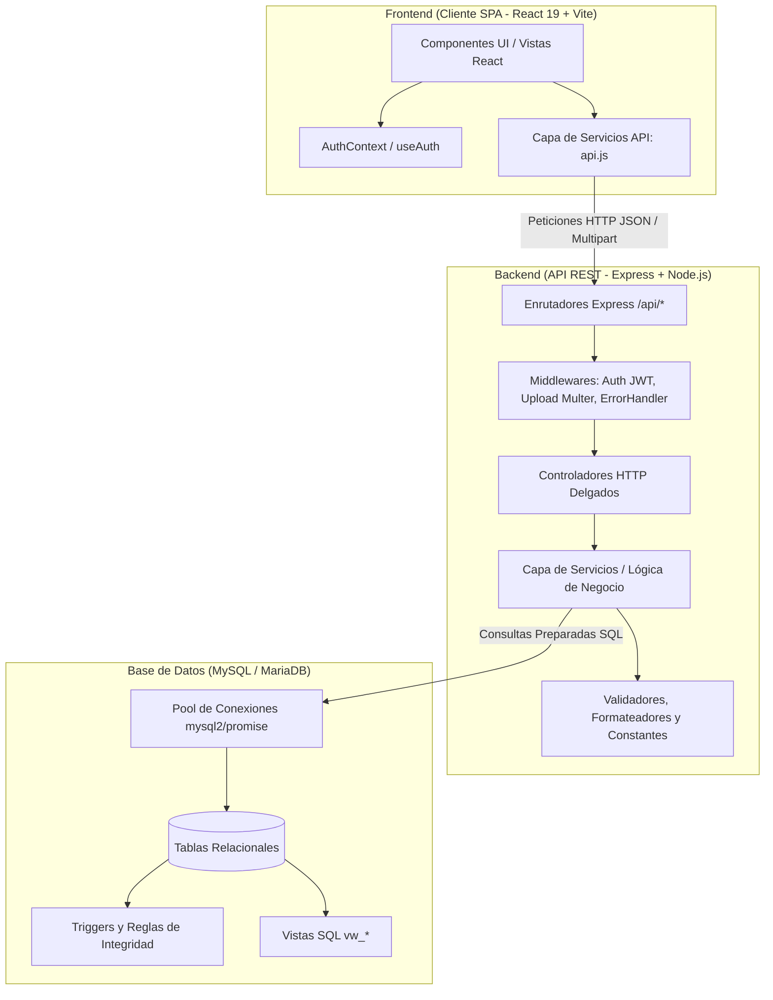
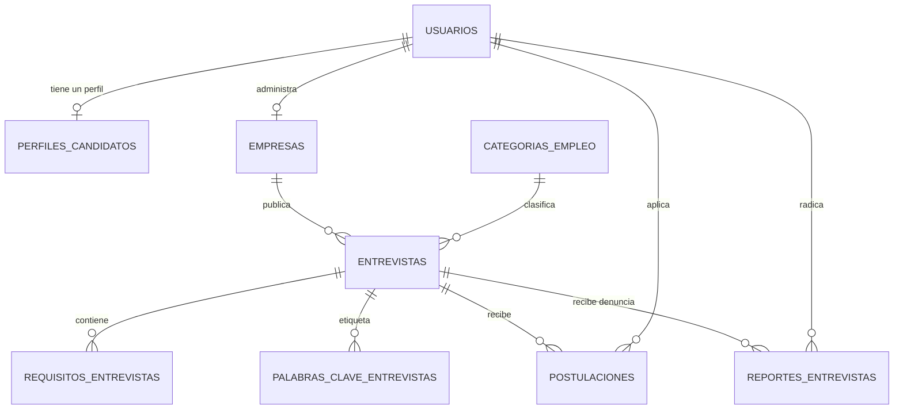

# 📘 MANUAL TÉCNICO DE LA PLATAFORMA WORKINX

**Proyecto Formativo SENA 2026**  
**Programa:** Análisis y Desarrollo de Software (ADSO)  
**Versión del Sistema:** 1.0.0  
**Fecha de Documentación:** Septiembre 2026  

---

## 1. INTRODUCCIÓN Y ALCANCE

### 1.1 Propósito del Documento
El presente **Manual Técnico** describe la arquitectura, diseño de base de datos, módulos de software, endpoints de la API REST, estándares de seguridad y procedimientos de instalación y despliegue del sistema **WorkInX**. Está dirigido a desarrolladores, administradores de bases de datos, líderes técnicos y evaluadores académicos interesados en el mantenimiento y escalabilidad de la plataforma.

### 1.2 Descripción del Sistema
**WorkInX** es una plataforma web orientada a democratizar el acceso a oportunidades laborales mediante entrevistas estructuradas, priorizando a jóvenes, recién egresados y personas sin experiencia previa. El sistema conecta de forma bidireccional a:
1. **Candidatos**: Personas que buscan oportunidades laborales, exploran entrevistas filtradas y envían su postulación junto con su currículum vitae (CV).
2. **Empresas**: Entidades públicas o privadas clasificadas según su número de empleados que gestionan y publican entrevistas de empleo y evalúan postulantes.
3. **Administradores**: Moderadores del sistema encargados de la supervisión de reportes e integridad de las publicaciones.

---

## 2. ARQUITECTURA DE SOFTWARE

El sistema adopta una **Arquitectura en Capas desacoplada** (*Layered Architecture*) dividida en dos aplicaciones independientes comunicadas a través de una API RESTful sobre HTTP/HTTPS:



### 2.1 Backend (Arquitectura por Capas)
- **Configuración (`src/config/`)**: Inicialización del pool de conexiones `mysql2/promise` con fallbacks seguros.
- **Rutas (`src/routes/`)**: Mapeo estricto de verbos HTTP (`GET`, `POST`, `PUT`, `DELETE`) hacia middlewares y controladores.
- **Middlewares (`src/middlewares/`)**:
  - `auth.middleware.js`: Validación y decodificación de tokens JWT `Bearer`.
  - `upload.middleware.js`: Manejo de subida de archivos CV con filtro de extensiones (`.pdf`, `.doc`, `.docx`) y límite de 5 MB.
  - `error.middleware.js`: Interceptor centralizado de excepciones y errores de Multer.
- **Controladores (`src/controllers/`)**: Recepción de parámetros de entrada, validaciones de esquema HTTP y delegación a la capa de servicios.
- **Servicios (`src/services/`)**: Implementación de la lógica de negocio pura, transacciones de base de datos (`beginTransaction`, `commit`, `rollback`) y persistencia.
- **Utilidades (`src/utils/`)**: Módulos auxiliares de validación de cédulas/contraseñas, formateadores de moneda y enumeraciones.

### 2.2 Frontend (Arquitectura Modular Basada en Dominios)
- **Context API (`src/context/` & `src/hooks/`)**: Estado global de autenticación persistido en `localStorage` y expuesto mediante el hook `useAuth()`.
- **Capa de Servicios (`src/services/`)**: Cliente HTTP centralizado (`api.js`) que inyecta automáticamente cabeceras de autorización y estandariza las respuestas.
- **Páginas y Vistas (`src/pages/`)**: Organizadas por dominio funcional (`auth`, `entrevistas`, `perfil`, `Home.jsx`).
- **Componentes (`src/components/`)**: Subdivididos en componentes de estructura (`layout/`) y componentes de diálogo modal (`modals/`).

---

## 3. REQUERIMIENTOS DEL ENTORNO DE OPERACIÓN

### 3.1 Requerimientos de Hardware (Servidor Mínimo)
- **Procesador**: 1.5 GHz Dual Core o superior.
- **Memoria RAM**: 2 GB (Recomendado 4 GB en entornos de producción).
- **Almacenamiento**: 10 GB de espacio libre en disco para base de datos y archivos subidos (`uploads/`).

### 3.2 Requerimientos de Software
- **Sistema Operativo**: Windows 10/11, Linux (Ubuntu 20.04+ / Debian 11+) o macOS.
- **Entorno de Ejecución**: Node.js v18.0.0 o superior (LTS recomendado).
- **Gestor de Paquetes**: npm v9.0.0+ o Yarn v1.22+.
- **Motor de Base de Datos**: MySQL Community Server 8.0+ o MariaDB 10.4+.
- **Navegador Web**: Google Chrome 100+, Mozilla Firefox 100+, Microsoft Edge o Safari compatible con ECMAScript 2022+.

---

## 4. MODELO DE DATOS Y BASE DE DATOS

El motor de almacenamiento utilizado es **InnoDB** con codificación `utf8mb4` y colación `utf8mb4_unicode_ci`.

### 4.1 Diagrama Entidad - Relación (Resumen Estructural)



### 4.2 Diccionario de Datos

#### Tabla: `usuarios`
Almacena las credenciales y datos básicos de todos los actores del sistema.
| Campo | Tipo | Nulo | Por Defecto | Descripción |
|---|---|---|---|---|
| `id` | INT(11) | NO | AUTO_INCREMENT | Clave primaria. |
| `nombre_completo` | VARCHAR(120) | NO | | Nombre o razón social inicial. |
| `correo` | VARCHAR(150) | NO | | Correo electrónico único. |
| `password_hash` | VARCHAR(255) | NO | | Contraseña encriptada con Bcrypt. |
| `rol` | ENUM('candidato','empresa','admin') | NO | | Rol asignado en la plataforma. |
| `telefono` | VARCHAR(20) | SÍ | NULL | Teléfono de contacto. |
| `estado` | ENUM('activo','inactivo','bloqueado') | NO | 'activo' | Estado de la cuenta. |
| `fecha_creacion` | TIMESTAMP | NO | CURRENT_TIMESTAMP | Fecha de registro. |
| `fecha_actualizacion` | TIMESTAMP | SÍ | NULL | Fecha de última modificación. |

#### Tabla: `perfiles_candidatos`
Datos complementarios para usuarios con rol `candidato`.
| Campo | Tipo | Nulo | Por Defecto | Descripción |
|---|---|---|---|---|
| `id` | INT(11) | NO | AUTO_INCREMENT | Clave primaria. |
| `usuario_id` | INT(11) | NO | | Clave foránea referenciando `usuarios(id)`. |
| `tipo_documento` | ENUM('CC','TI','CE','PPT') | NO | | Tipo de identificación oficial. |
| `documento` | VARCHAR(20) | NO | | Número de documento. |
| `ciudad_residencia` | VARCHAR(100) | NO | | Municipio o ciudad del candidato. |
| `categoria_edad` | ENUM('menor_edad','mayor_edad') | NO | | Clasificación etaria. |
| `acepta_terminos` | TINYINT(1) | NO | 0 | Indicador de aceptación legal (1 = Sí). |
| `fecha_creacion` | TIMESTAMP | NO | CURRENT_TIMESTAMP | Fecha de creación del perfil. |

#### Tabla: `empresas`
Datos de la persona jurídica o empresa que publica vacantes.
| Campo | Tipo | Nulo | Por Defecto | Descripción |
|---|---|---|---|---|
| `id` | INT(11) | NO | AUTO_INCREMENT | Clave primaria. |
| `usuario_id` | INT(11) | NO | | Clave foránea referenciando `usuarios(id)`. |
| `nombre_empresa` | VARCHAR(150) | NO | | Nombre comercial de la empresa. |
| `descripcion` | TEXT | SÍ | NULL | Breve reseña de la compañía. |
| `industria` | VARCHAR(100) | NO | | Sector productivo. |
| `sitio_web` | VARCHAR(200) | SÍ | NULL | URL del portal web oficial. |
| `telefono_contacto` | VARCHAR(20) | NO | | Teléfono de contacto corporativo. |
| `direccion` | VARCHAR(200) | NO | | Dirección física principal. |
| `rango_empleados` | ENUM('1-10','11-50','51-200','201-500','500+') | NO | | Rango seleccionado. |
| `clasificacion_empresa` | ENUM('microempresa','pequena_empresa','mediana_empresa','gran_empresa','macroempresa') | NO | | Clasificación automática. |
| `tipo_entidad` | ENUM('publica','privada') | NO | | Naturaleza de la organización. |
| `acepta_terminos` | TINYINT(1) | NO | 0 | Indicador de aceptación legal (1 = Sí). |

#### Tabla: `entrevistas`
Registra las ofertas y convocatorias a entrevista publicadas por empresas.
| Campo | Tipo | Nulo | Por Defecto | Descripción |
|---|---|---|---|---|
| `id` | INT(11) | NO | AUTO_INCREMENT | Clave primaria. |
| `empresa_id` | INT(11) | NO | | Clave foránea referenciando `empresas(id)`. |
| `categoria_id` | INT(11) | SÍ | NULL | Clave foránea a `categorias_empleo(id)`. |
| `titulo` | VARCHAR(150) | NO | | Cargo u objetivo de la entrevista. |
| `descripcion` | TEXT | NO | | Detalle de funciones y responsabilidades. |
| `tipo` | ENUM('primer_empleo','profesional','emprendedor') | NO | | Enfoque de la convocatoria. |
| `modalidad` | ENUM('presencial','remoto','hibrido') | NO | | Esquema de trabajo. |
| `ubicacion` | VARCHAR(150) | NO | | Ciudad o departamento. |
| `lugar_entrevista` | VARCHAR(250) | NO | | Sede física o enlace de videollamada. |
| `fecha_entrevista` | DATE | NO | | Fecha en que se realizará la entrevista. |
| `hora_entrevista` | TIME | NO | | Hora programada. |
| `salario_a_convenir` | TINYINT(1) | NO | 0 | 1 si el salario no es fijo. |
| `salario_min` | DECIMAL(12,2) | SÍ | NULL | Rango salarial mínimo en COP. |
| `salario_max` | DECIMAL(12,2) | SÍ | NULL | Rango salarial máximo en COP. |
| `fecha_limite` | DATE | NO | | Fecha máxima para postularse. |
| `activa` | TINYINT(1) | NO | 1 | Estado lógico de visibilidad. |
| `estado` | ENUM('publicada','pausada','cerrada','eliminada') | NO | 'publicada' | Estado administrativo. |

#### Tabla: `postulaciones`
Registra las aplicaciones realizadas por los candidatos.
| Campo | Tipo | Nulo | Por Defecto | Descripción |
|---|---|---|---|---|
| `id` | INT(11) | NO | AUTO_INCREMENT | Clave primaria. |
| `entrevista_id` | INT(11) | NO | | Clave foránea a `entrevistas(id)`. |
| `usuario_id` | INT(11) | NO | | Clave foránea a `usuarios(id)` (candidato). |
| `mensaje` | TEXT | SÍ | NULL | Presentación o mensaje opcional. |
| `cv_path` | VARCHAR(255) | NO | | Ruta relativa del archivo PDF/DOC en servidor. |
| `estado` | ENUM('pendiente','revisado','aceptado','rechazado','retirado') | NO | 'pendiente' | Estado del proceso de selección. |
| `fecha_postulacion` | TIMESTAMP | NO | CURRENT_TIMESTAMP | Fecha de envío de la aplicación. |

#### Tabla: `reportes_entrevistas`
Denuncias radicadas por los usuarios contra publicaciones sospechosas.
| Campo | Tipo | Nulo | Por Defecto | Descripción |
|---|---|---|---|---|
| `id` | INT(11) | NO | AUTO_INCREMENT | Clave primaria. |
| `entrevista_id` | INT(11) | NO | | Clave foránea a `entrevistas(id)`. |
| `usuario_id` | INT(11) | SÍ | NULL | Clave foránea al usuario denunciante. |
| `tipo_reporte` | ENUM('fraude','informacion_falsa','contenido_inapropiado','spam','otro') | NO | | Motivo del reporte. |
| `descripcion` | TEXT | NO | | Justificación de la queja. |
| `evidencia` | TEXT | SÍ | NULL | Enlace o texto complementario. |
| `estado` | ENUM('pendiente','en_revision','resuelto','rechazado') | NO | 'pendiente' | Estado del reporte. |

### 4.3 Triggers y Lógica en Base de Datos
- **`trg_entrevistas_fecha_edicion`** (`BEFORE UPDATE ON entrevistas`): Actualiza automáticamente la columna `fecha_edicion` al detectar cambios en los campos clave de la entrevista.
- **`trg_desactivar_entrevista_por_reportes`** (`AFTER INSERT ON reportes_entrevistas`): Cuenta el número de denuncias activas (`pendiente`, `en_revision`). Si acumula 3 o más reportes, la entrevista pasa automáticamente a estado `pausada` y `activa = 0` para proteger a los usuarios.
- **`trg_reportes_fecha_resolucion`** (`BEFORE UPDATE ON reportes_entrevistas`): Marca la fecha y hora en que un reporte pasa a estado `resuelto` o `rechazado`.

---

## 5. CATÁLOGO DE LA API REST (ENDPOINTS)

Todas las respuestas exitosas y de error responden con cabecera `Content-Type: application/json`. Las rutas protegidas exigen el encabezado HTTP:
`Authorization: Bearer <token_jwt>`

### 5.1 Endpoints de Sistema
| Método | Endpoint | Acceso | Descripción | Códigos HTTP |
|---|---|---|---|---|
| `GET` | `/` | Público | Comprobación de estado general y versión. | 200 |
| `GET` | `/api/health` | Público | Healthcheck con estado de conexión a MySQL y tiempo activo. | 200, 503 |

### 5.2 Endpoints de Autenticación (`/api/auth`)
| Método | Endpoint | Acceso | Body Requerido (JSON) | Códigos HTTP |
|---|---|---|---|---|
| `POST` | `/api/auth/registro-candidato` | Público | `nombreCompleto`, `tipoDocumento`, `documento`, `correo`, `password`, `telefono`, `ciudad`, `edadRango`, `aceptaTerminos` | 201, 400, 409, 500 |
| `POST` | `/api/auth/registro-empresa` | Público | `nombre`, `correo`, `password`, `telefono`, `direccion`, `industria`, `rango_empleados`, `tipoEntidad`, `aceptaTerminos` | 201, 400, 409, 500 |
| `POST` | `/api/auth/login` | Público | `correo`, `password` | 200, 400, 401, 403, 500 |
| `GET` | `/api/auth/perfil` | Protegido | Ninguno | 200, 401, 403, 404, 500 |

### 5.3 Endpoints de Entrevistas (`/api/entrevistas`)
| Método | Endpoint | Acceso | Parámetros / Body | Códigos HTTP |
|---|---|---|---|---|
| `GET` | `/api/entrevistas` | Público | Query params opcionales de búsqueda. | 200, 500 |
| `GET` | `/api/entrevistas/:id` | Público | `id` en path params. | 200, 404, 500 |
| `GET` | `/api/entrevistas/empresa/mis-entrevistas` | Empresa | Requiere Token de empresa. | 200, 403, 404, 500 |
| `POST` | `/api/entrevistas` | Empresa | `titulo`, `categoria`, `descripcion`, `tipo`, `modalidad`, `ubicacion`, `lugarEntrevista`, `fechaEntrevista`, `horaEntrevista`, `salarioAConvenir`, `salarioMin`, `salarioMax`, `requisitos`, `palabrasClave`, `fechaLimite` | 201, 400, 403, 404, 500 |
| `PUT` | `/api/entrevistas/:id` | Empresa | Mismo esquema de creación + `id` en path params. | 200, 400, 403, 404, 500 |
| `DELETE`| `/api/entrevistas/:id` | Empresa | `id` en path params (borrado lógico). | 200, 403, 404, 500 |

### 5.4 Endpoints de Postulaciones (`/api/postulaciones`)
| Método | Endpoint | Acceso | Tipo de Petición / Parámetros | Códigos HTTP |
|---|---|---|---|---|
| `POST` | `/api/postulaciones` | Candidato | `multipart/form-data`: `entrevistaId`, `mensaje` (opcional), `cv` (archivo binario). | 201, 400, 403, 404, 409, 500 |
| `GET` | `/api/postulaciones/mis-postulaciones` | Candidato | Requiere Token de candidato. | 200, 403, 500 |
| `GET` | `/api/postulaciones/entrevista/:id` | Empresa | `id` de la entrevista en path params. | 200, 403, 404, 500 |
| `PUT` | `/api/postulaciones/:id/estado` | Empresa | `id` de postulación en path. Body: `{ "estado": "revisado"\|"aceptado"\|"rechazado" }`. | 200, 400, 403, 404, 500 |

### 5.5 Endpoints de Reportes (`/api/reportes`)
| Método | Endpoint | Acceso | Body Requerido (JSON) | Códigos HTTP |
|---|---|---|---|---|
| `POST` | `/api/reportes` | Protegido | `entrevistaId`, `tipoReporte`, `descripcion`, `evidencia` | 201, 400, 404, 409, 500 |

---

## 6. SEGURIDAD Y ESTÁNDARES IMPLEMENTADOS

1. **Protección de Contraseñas**: Se emplea `bcryptjs` con un factor de costo (*salt rounds*) de 10. Las contraseñas nunca se almacenan en texto plano ni se devuelven en respuestas JSON.
2. **Tokens sin Estado (JWT)**: Los tokens son firmados criptográficamente mediante algoritmo HMAC SHA-256 usando `process.env.JWT_SECRET`, con caducidad estricta de 2 horas.
3. **Control de Acceso Basado en Roles (RBAC)**: Los endpoints validan que el rol codificado en el token corresponda al actor permitido (ej. solo `empresa` puede crear vacantes y solo `candidato` puede postularse con CV).
4. **Prevención de Inyección SQL**: Todas las interacciones con MySQL hacen uso de sentencias preparadas con parámetros vinculados (`?`), evitando concatenaciones de texto vulnerables.
5. **Control de Archivos Subidos**: Multer renombra los archivos con marcas temporales y caracteres seguros alfanuméricos (`Date.now()_nombreSeguro.ext`), limitando el peso a 5 MB y restringiendo tipos MIME a documentos PDF, DOC y DOCX.
6. **Políticas CORS**: Activadas mediante el middleware `cors()`, permitiendo controlar orígenes autorizados para el consumo de la API.

---

## 7. GUÍA DE INSTALACIÓN, CONFIGURACIÓN Y DESPLIEGUE

### 7.1 Clonación y Preparación
```bash
git clone <URL_DEL_REPOSITORIO>
cd WorkInX
```

### 7.2 Configuración de la Base de Datos
1. Inicie su motor de base de datos MySQL (por ejemplo, mediante XAMPP, MySQL Server o Docker).
2. Ejecute los scripts en el orden indicado:
   ```sql
   SOURCE database/workinx.sql;
   SOURCE database/procedures_triggers.sql;
   SOURCE database/inserts_demo.sql; -- Opcional: datos de prueba
   ```

### 7.3 Configuración y Puesta en Marcha del Backend
1. Ingrese a la carpeta `backend`:
   ```bash
   cd backend
   npm install
   ```
2. Cree el archivo `.env` a partir de `.env.example`:
   ```env
   PORT=3000
   DB_HOST=localhost
   DB_USER=root
   DB_PASSWORD=
   DB_NAME=workinx
   DB_PORT=3306
   JWT_SECRET=tu_clave_secreta_jwt_2026
   APP_URL=http://localhost:3000
   ```
3. Ejecute el servidor:
   ```bash
   # Modo desarrollo (con recarga automática)
   npm run dev

   # Modo producción
   npm run start
   ```

### 7.4 Configuración y Puesta en Marcha del Frontend
1. En una nueva terminal, ingrese a la carpeta `frontend`:
   ```bash
   cd frontend
   npm install
   ```
2. Cree el archivo `.env` basado en `.env.example`:
   ```env
   VITE_API_URL=http://localhost:3000
   ```
3. Inicie el servidor de desarrollo o compile para producción:
   ```bash
   # Modo desarrollo
   npm run dev

   # Compilar para producción (genera carpeta dist/)
   npm run build
   ```
4. Ingrese en el navegador a: `http://localhost:5173`.
